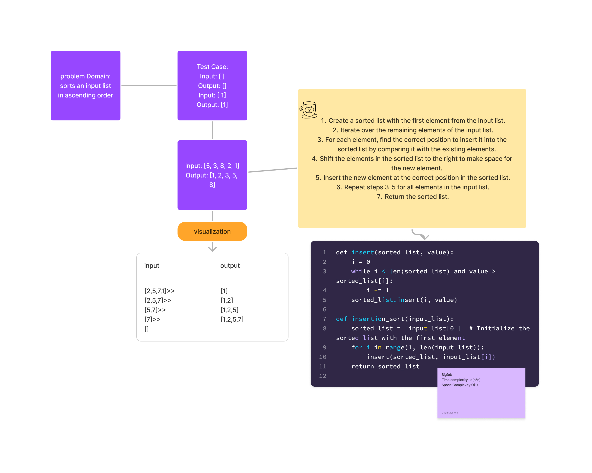

# Code Challenge 26 
## WhiteBoard

### Approach&& efficiency:
divide the input list into two portions: a sorted portion and an unsorted portion. The sorted portion starts with the first element of the list, and the unsorted portion contains the remaining elements.
Big(o):Time complexity : o(n*n)
Space Complexity:O(1)

[link to code ](cc.py)