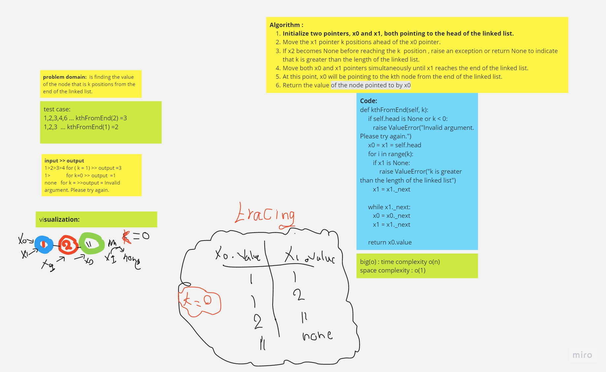

# Challenge 7
## kth from end

Description:
The challenge is to find the kth node from the end of a singly linked list. Given a linked list, the task is to determine the value of the node that is k positions away from the end of the list. The position count starts from 1, where the last node is considered position 1, the second-to-last node is position 2, and so on.

## Whiteboard Process

## Approach & Efficiency
Approach:
To find the kth node from the end, we can use the "two pointers" technique. We initialize two pointers, x0 and x1, and set them both to the head of the linked list. We then move the x1 pointer k positions ahead of the x0 pointer. After that, we move both pointers simultaneously until the x1 pointer reaches the end of the linked list. At this point, the x0 pointer will be pointing to the kth node from the end.

Efficiency:
The time complexity of this approach is O(n), where n is the length of the linked list. We iterate through the list once to reach the desired node.

The space complexity is O(1) since we are using only two pointers and not utilizing any extra data structures that grow with the input size.

Overall, this approach is efficient with linear time complexity and constant space complexity.

## Solution
[Link to my code](Ds/linkedlist.py)
[link to pull]()
