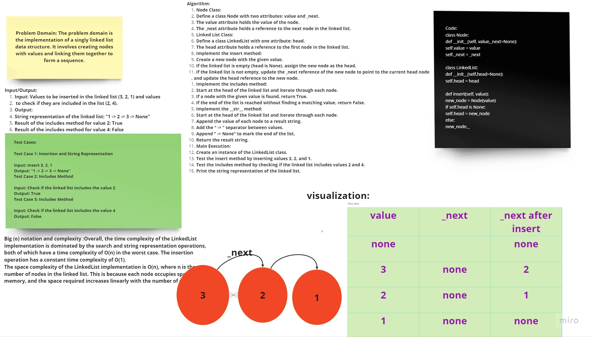

# **Author : Dua'a Melhem**

*****
## WhiteBoard for this challenge 

******
### Summary:
The code defines a Node class that represents a single node in a linked list. Each node contains a value and a reference to the next node in the list. The code also defines a LinkedList class that represents a linked list data structure. The linked list class has methods to insert a new node, check if a value is present in the list, and convert the list to a string representation. The code also includes a simple test using the LinkedList class.
****
### Description:
The code implements a linked list data structure using two classes, Node and LinkedList. The Node class represents a single node in the linked list and has two attributes: value to store the value of the node and _next to store the reference to the next node in the list. The LinkedList class represents the linked list and has a head attribute to keep track of the first node in the list.

The LinkedList class has the following methods:

__init__(self, head=None): Initializes the linked list with an optional head node.
insert(self, value): Inserts a new node with the given value at the beginning of the list. If the list is empty, the new node becomes the head.
includes(self, value): Checks if a node with the given value exists in the list. Returns True if found, False otherwise.
to_string(self): Converts the linked list to a string representation. The method traverses the list and builds a string with the value of each node, separated by arrows (->), and ends with None.
Approach:
The code uses a singly linked list approach, where each node contains a value and a reference to the next node. The linked list class maintains a head attribute, which points to the first node in the list. When a new node is inserted, it is added at the beginning of the list by updating the head reference. The includes method traverses the list starting from the head and checks if any node has the target value. The to_string method iterates over the list, starting from the head, and builds a string representation by concatenating the values of each node.
****
### Efficiency:

Insertion: Inserting a new node at the beginning of the linked list has a time complexity of O(1) since it only requires updating the head reference.
Search (Includes): Searching for a value in the linked list has a time complexity of O(n) in the worst case, where n is the number of nodes in the list. This is because the search needs to iterate over the nodes until it finds a matching value or reaches the end of the list.
String Representation: Creating a string representation of the linked list has a time complexity of O(n) since it requires iterating over all the nodes in the list to concatenate their values.
Overall, the linked list provides efficient insertion at the beginning of the list, but searching for a value or creating a string representation requires traversing the entire list, which takes linear time.
*******
[link to code](Ds/linkedlist.py)
[link to pull](https://github.com/doaamelhem96/data-structures-and-algorithms/pull/11)
