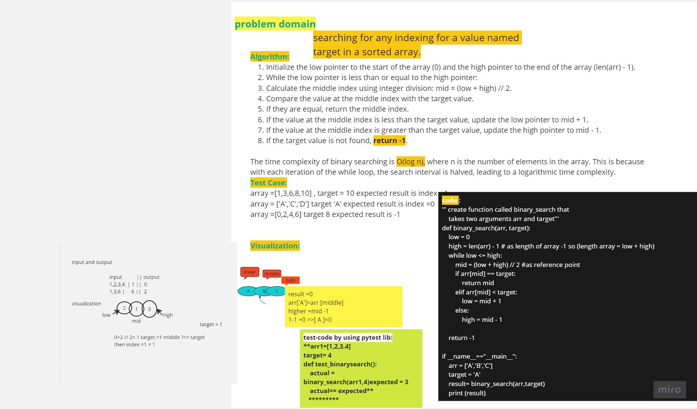

# code challenge-3
# Binary-Search Challenge 
****
**Summary:**
The binary_search function is an efficient algorithm for finding the position of a target value within a sorted array.
****
**Description:**
The binary_search function takes in two parameters: arr (the sorted array) and target (the value to be searched for). It returns the index of the target value in the array if it is found, or -1 if it is not present.
**Whiteboard  for this challenege:**

*********

**********
# The approach of Binary-Search method :
Binary search is an approach where you repeatedly divide a sorted list in half to search for a target value. Here's a simplified explanation of the approach:

1. Start with a sorted list.
2. Set a low pointer to the first element and a high pointer to the last element of the list.
3. While the low pointer is less than or equal to the high pointer:
4. Find the middle element by taking the average of the low and high pointers.
5. Compare the middle element with the target value:
- If they are equal, you have found the target value.
- If the middle element is less than the target value, move the low pointer to the element after the middle element.
- If the middle element is greater than the target value, move the high pointer to the element before the middle element.
- If the target value is not found after the loop, it is not present in the list.
******
# The Efficiency of **binary search** :
The efficiency of **binary search** is **high** because it has **a logarithmic time complexity**. This means that as **the size of the list increases**, the number of steps required to find the target value grows slowly. This makes binary search faster compared to linear search algorithms that have a linear time complexity.
****
# test-code by using pytest lib:
**arr1=[1,2,3,4]
target= 4
def test_binarysearch():
    actual = binary_search(arr1,4)expected = 3
    actual== expected**
   *********
   
[Link to my code ](.py)
***
**Created By :**
1. **Navigater:**[Dua'a Melhem](https://github.com/doaamelhem96)

2.  **Driver:**[Nearmeen Alkhatab ](https://github.com/Narmeenalkatab)