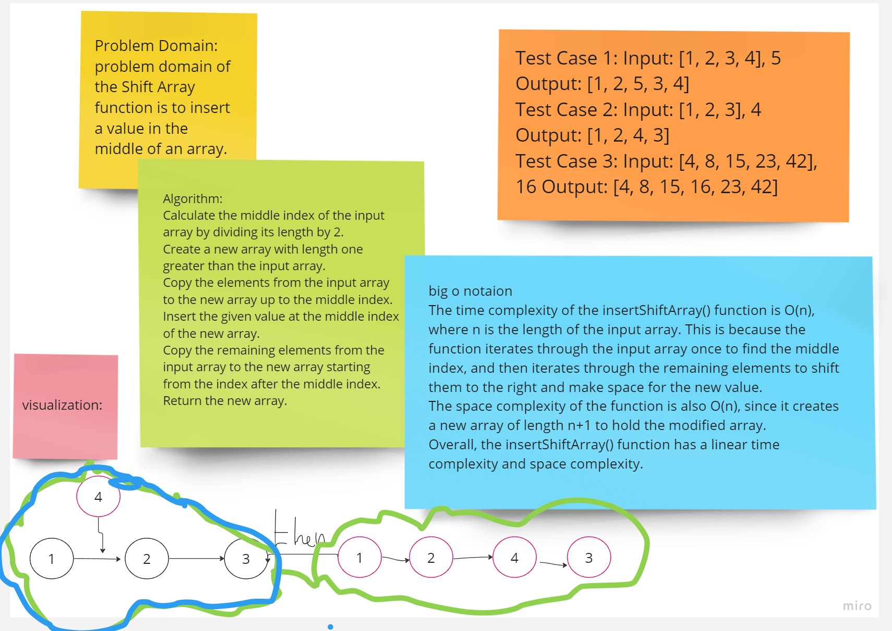
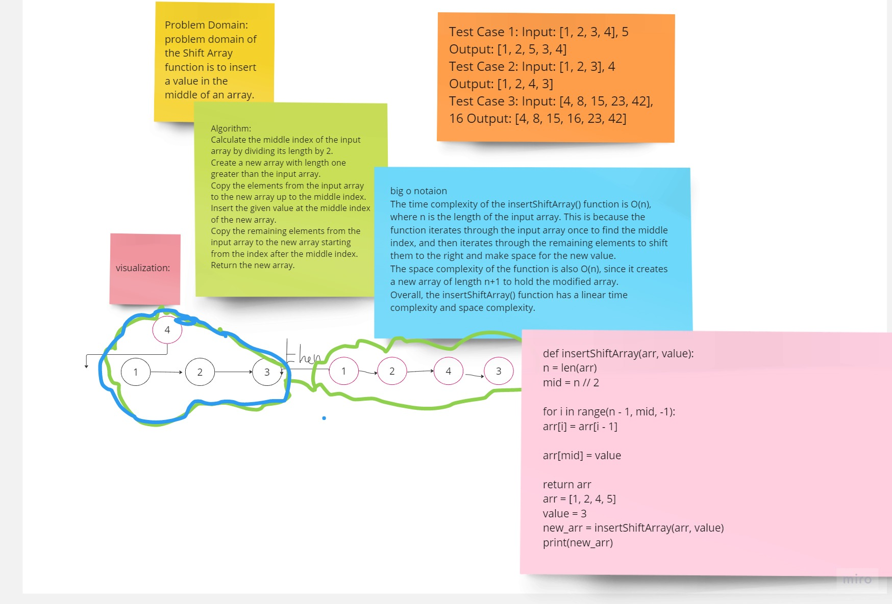

[Link to coding](.py)

*****

*****
**Approach & Efficiency**
 I created a function and used len to calculate the length of array, then i declare mid variable which equal the length devided by 2.
Also i used if condition to  check if the length equal even number or not. Finally i used insert() which take index and value.

# solution:
def insertShiftArray(arr, value):
    n = len(arr)
    mid = n // 2
    
    for i in range(n - 1, mid, -1):
        arr[i] = arr[i - 1]
    
    arr[mid] = value
    
    return arr
arr = [1, 2, 4, 5]
value = 3
new_arr = insertShiftArray(arr, value)
print(new_arr)

[Link to coding](.py)
