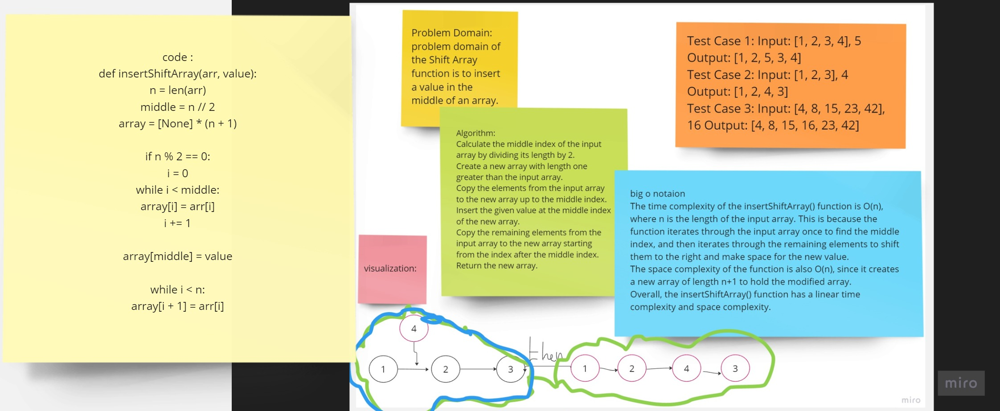

# array_Insert_Shift
## Summary:
The insertShiftArray function takes an array arr and a value value as input and inserts the value in the middle of the array. If the length of the input array is even, the function finds the middle position as n // 2 and shifts the elements to the right of the middle to make space for the new value. If the length is odd, the middle position is n // 2 + 1, and the elements to the right of the middle are shifted. The function creates a new array array with a length of n + 1 to accommodate the additional value and returns the modified array.

## Description:
The insertShiftArray function inserts a given value into an input array by creating a new array with a length one greater than the original array. It first determines the middle index of the input array based on whether the length is even or odd. Then, it initializes an empty array array with the updated length.

If the length is even, the function copies the elements from the original array arr to array up to the middle index. It then inserts the value at the middle index. After that, it continues copying the remaining elements from arr to array, shifting them to the right by one index.

If the length is odd, the process is similar, but the elements from the original array are copied up to the middle index plus one. The value is inserted at the index middle + 1, and the remaining elements are shifted to the right in the same manner.

Finally, the function returns the modified array array with the new value inserted in the middle.

It's worth noting that the function does not modify the original array and instead creates a new array to store the result
*****
## WhiteBoard 
***********

*****
**Approach:**
The insertShiftArray function follows the following approach to insert a value into the middle of an array:

Determine the length of the input array arr and calculate the middle index middle by performing an integer division (n // 2).
Create a new array array with a length one greater than the original array to accommodate the additional value.
Check if the length of the array is even or odd using the condition if n % 2 == 0.
If the length is even:
Copy the elements from arr to array up to the middle index using a while loop.
Insert the value at the middle index of array.
Continue copying the remaining elements from arr to array, shifting them to the right by one index.
If the length is odd:
Copy the elements from arr to array up to the middle index plus one using a while loop.
Insert the value at the index middle + 1 of array.
Continue copying the remaining elements from arr to array, shifting them to the right by one index.
Return the modified array with the new value inserted in the middle.
****
**Efficiency:**

Time Complexity: The time complexity of this approach is O(n), where n is the length of the input array. The function needs to iterate through the elements of the input array to copy them to the new array. In the worst case, it performs two passes over the elements.
Space Complexity: The space complexity is O(n) as well. The function creates a new array array with a length one greater than the input array. The space required grows linearly with the input size.
Overall, the insertShiftArray function has a time complexity of O(n) and a space complexity of O(n). It efficiently inserts a value into the middle of the input array while maintaining the relative order of the other elements.

# solution:
def insertShiftArray(arr, value):
    n = len(arr)
    middle = n // 2
    array = [None] * (n + 1)
    
    if n % 2 == 0:
        i = 0
        while i < middle:
            array[i] = arr[i]
            i += 1
        
        array[middle] = value
        
        while i < n:
            array[i + 1] = arr[i]
            i += 1
    else:
        i = 0
        while i <= middle:
            array[i] = arr[i]
            i += 1
        
        array[middle + 1] = value
        
        while i < n:
            array[i + 1] = arr[i]
            i += 1
    
    return array

"""*****"""
def removeShiftArray(z):
    n = len(z)
    middle = n // 2
    nz = [None] * (n - 1)
    i = 0
    j = 0

    if n % 2 == 0:
        while i < n:
            if i != middle:
                nz[j] = z[i]
                j += 1
            i += 1
    else:
        while i < n:
            if i != middle + 1:
                nz[j] = z[i]
                j += 1
            i += 1
    
    return nz

if __name__=="__main__":
   arr2 = [2, 4, 6, 7, 8]
   print(f" my origin array is <<<\t{arr2}\t>>>, My_array will become after insert and shiftting is <<<{insertShiftArray(arr2,0)}>>>\n******")
   print(f"******\n my origin array is <<<\t{arr2}\t>>> , My_array will become after remove middle element and filling the gaps is <<<{removeShiftArray(arr2)}>>>")

 

[Link to coding](.py)
