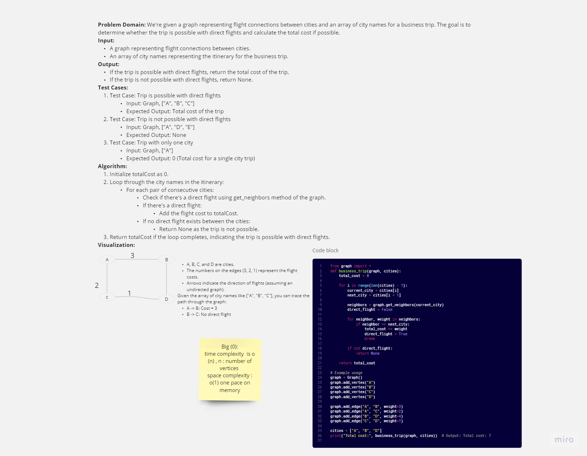

# Code Challenge 37 : graph-business-trip

## WhiteBoard 

**Summary:**
Given a graph representing flight connections between cities and an array of city names representing a trip itinerary, determine if the trip is possible with direct flights and calculate the total cost if possible.

**Approach:**
1. Create a graph using the provided `Graph` class, representing cities as vertices and flight connections as weighted edges.
2. Iterate through the array of city names in the itinerary.
3. For each consecutive pair of cities in the itinerary, check if there's a direct flight between them using the graph's `get_neighbors` method.
4. If a direct flight is found, add the flight cost to the total cost.
5. If a direct flight is not found for any pair of cities, return `None` to indicate an impossible trip.

**Efficiency:**
- Time Complexity: O(N), where N is the number of cities in the itinerary. 
- Space Complexity: O(1), as the space used is minimal and independent of the number of cities.
---
[link to my code](trip.py)

