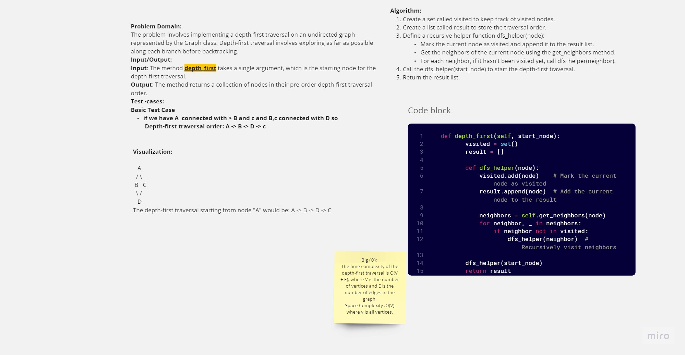

# Code Challenge 38 : Graph Depth First
 
## White_Board:

---
## Approach & Efficiency
Approach:
Create an empty set called visited to keep track of visited nodes during traversal.
Create an empty list called result to store the depth-first traversal order.
Define a recursive helper function dfs_helper(node):
Mark the current node as visited by adding it to the visited set.
Append the current node to the result list.
Get the neighbors of the current node using the get_neighbors method.
For each neighbor, if it hasn't been visited, call dfs_helper(neighbor) recursively.
Call the dfs_helper function with the starting node to initiate the depth-first traversal.
Return the result list containing the traversal order.
1. Time complexity O (n) where n is is O(V + E), where V is the number of vertices and E is the number of edges in the graph. is number of 
vertices in graph.
2. Space Complexity :O(V) where v is all vertices 
----
Description:
The depth_first method of the Graph class performs a pre-order depth-first traversal on an undirected graph. It starts from the given start_node and explores as far as possible along each branch before backtracking. The traversal order is stored in a collection and returned as the output.
---
[link to code](depth.py)