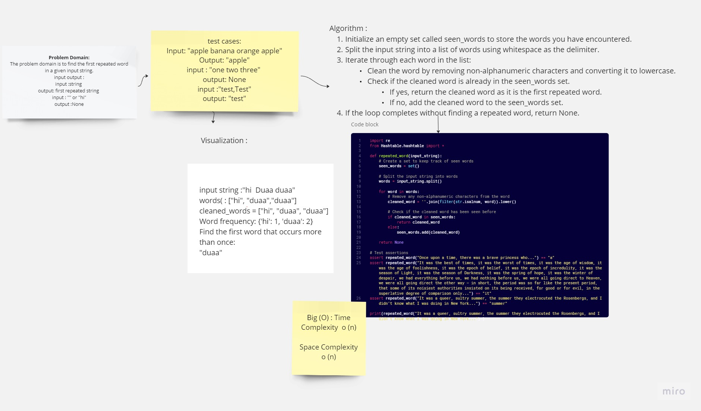

# Code Challenge 31 : Hashmap_Repeated_Word
## Descriptions of Repeated word

This program takes a string as input and returns first occurrence of repeating words in that sentence
any else it will return None.
---
## WhiteBoard :

****
### approach and effecincy :
- First we split all sentences into individual words using space delimiter, then convert them to lowercase for case,return the first repeated word if there any word repeated else return None

Big (O) : Time Complexity  o (n)

Space Complexity  o (n)
### To test the code run:
```
pytest
```
### To run the code :
```
python repeated_word.py
```
[code link](./repeated_word.py)
[Test link](./tests/test_repeated.py)