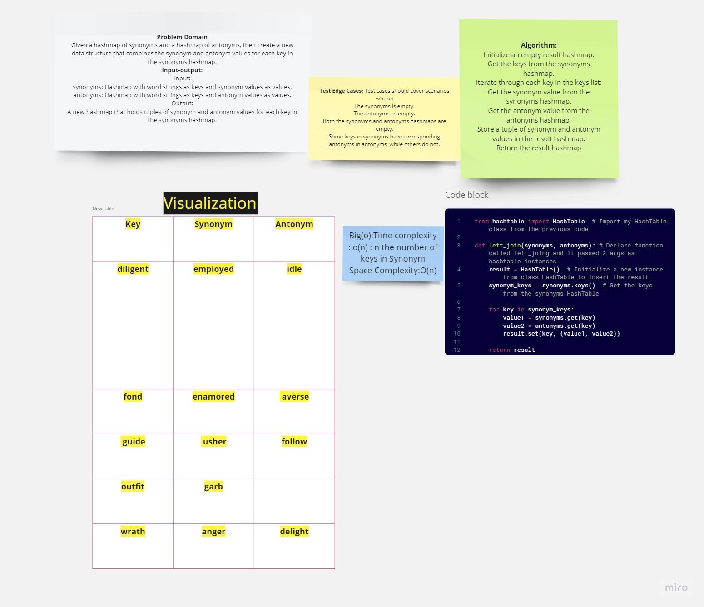

# Code Challenge 33 LEFT JOIN for 2 Hashmaps. 
## WhiteBoard

## Summary :

The left_join function takes two hashmaps (synonyms and antonyms) as input and performs a LEFT JOIN operation on them
### Approach&& efficiency:
Approach and Efficiency:
For each key, the function creates a tuple consisting of the synonym value from synonyms and the corresponding antonym value from antonyms, and then stores this tuple in the result hashmap.  .
Big(o):Time complexity : o(n) : n the number of keys in Synonym
Space Complexity:O(n)

[link to code ](lefjoin.py)