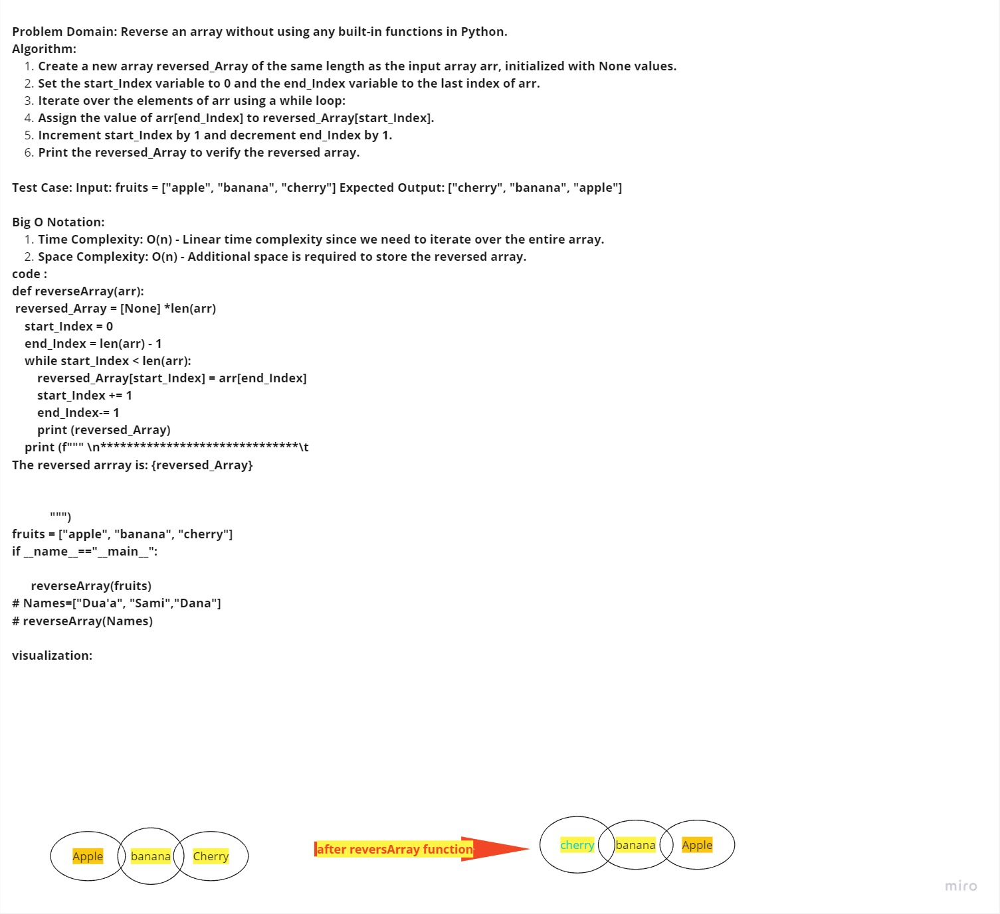

# Reverse-Array
*********

*****
# Whiteboard Process

*****
*****

## Approach & Efficiency

Iterate over the input array from the end to the start using a for loop and range function.
Append each element in the input array to a new output array in the reverse order.
Efficiency
Time complexity: O(n) - since the algorithm must visit each element in the input array exactly once.
Space complexity: O(n) - since the algorithm creates a new array of size n to store the reversed elements.
********
## Solution
[Link to Code](data.py)

-----------
#psuecode :
def reverseArray(arr):
    revarray = []
    for i in range(len(arr)-1, -1, -1):
       revarray.append(arr[i])
       print (revarray)
    return revarray

arr2 = [1, 2, 3, 4, 5]

print ('''********************************************
 ****** The reverse Array is :''',reverseArray(arr2))

