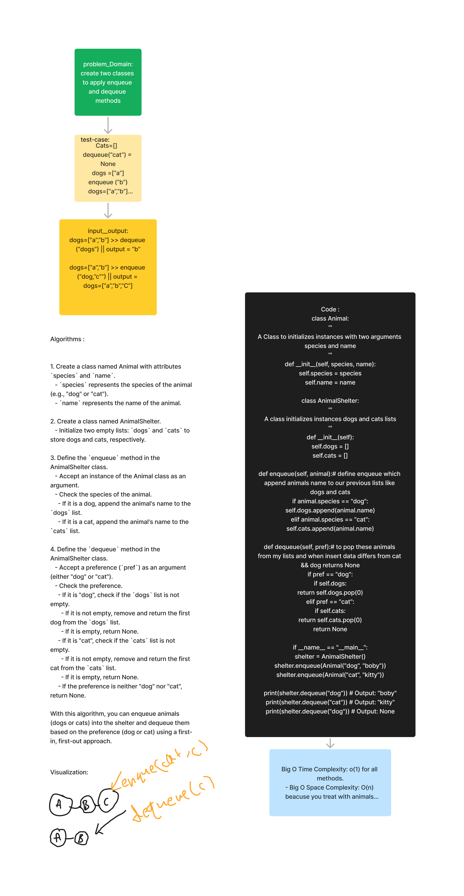

# Code Challenge 12  --- stack-queue-animal-shelter
## WhiteBoard:

*****
## Summary&& Describtion ::
this challenge to apply queue but by using Animals class

*****

### Approach && effecincy :
- Big O Time Complexity: o(1) for all methods.
- Big O Space Complexity: O(n) beacuse you treat with animals lists
