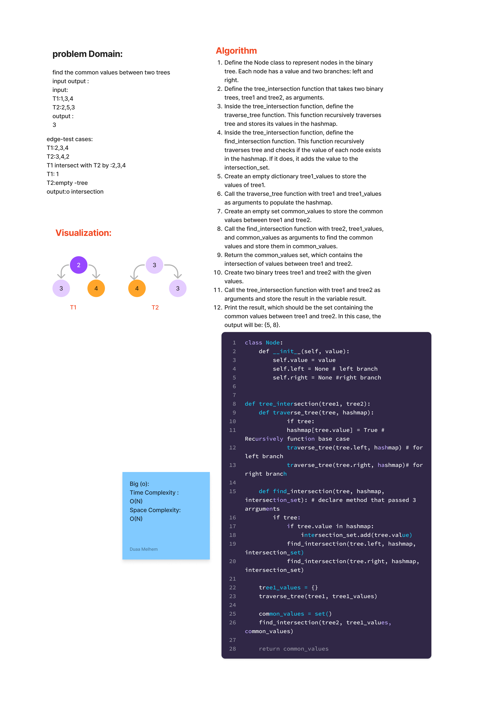

# Code_Challenge 32 : Tree_Intersetion
## WhiteBoard :

Summary:
The provided algorithm aims to find the intersection of values between two binary trees. It uses a hashmap to store the values of one tree and then traverses the other tree to find common values.

Description:
The algorithm defines a Node class to represent nodes in the binary tree, where each node has a value and two branches: left and right. The main function, tree_intersection, takes two binary trees (tree1 and tree2) as arguments and returns a set of common values found in both trees.

Approach:

Hash Table for tree1: Implement a hash table (or a similar data structure) to store the values of tree1. This hash table will allow efficient lookup operations.

Collect Values from tree1: Traverse tree1 using a tree traversal algorithm (e.g., in-order, pre-order, post-order) and insert each value into the hash table.

Find Common Values: Traverse tree2 using the same traversal algorithm as before. For each value encountered in tree2, check if it exists in the hash table created from tree1. If it does, add it to a set of common values.

Return Common Values: Return the set of common values obtained in the previous step.
[Link to code](./tree_intersection.py)