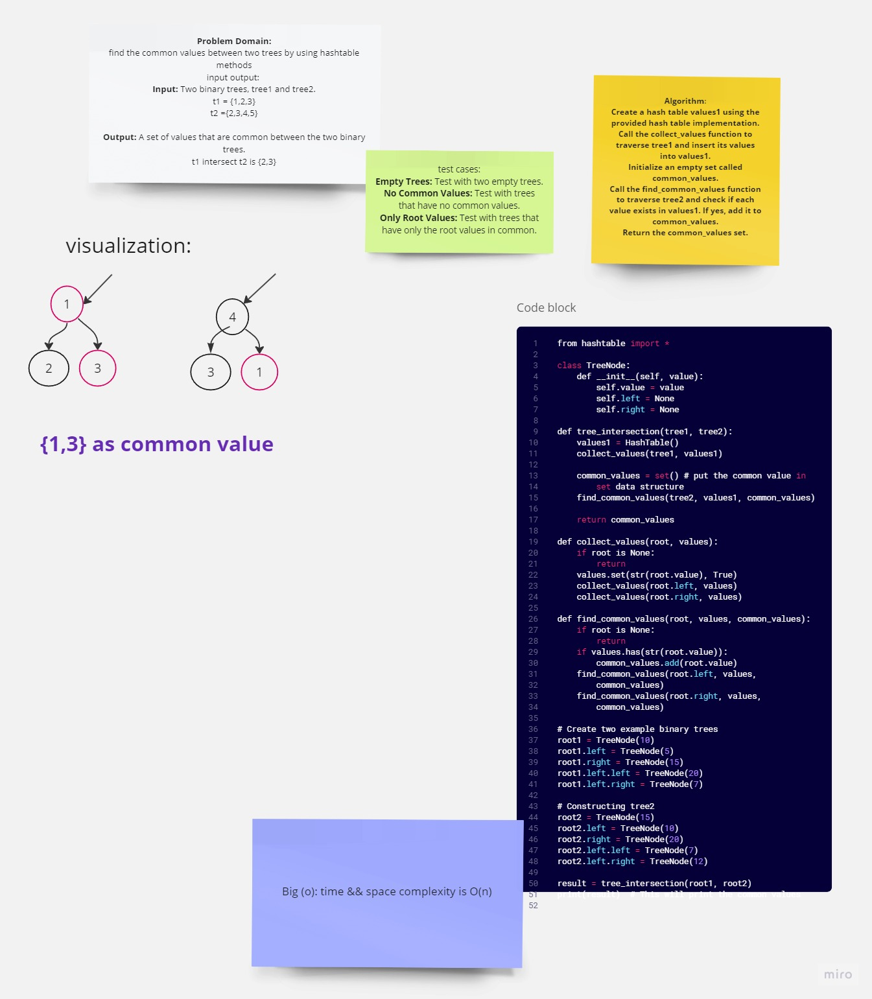

# Code_Challenge 32 : Tree_Intersetion
## WhiteBoard :

Summary:
The provided algorithm aims to find the intersection of values between two binary trees. It uses a hashmap to store the values of one tree and then traverses the other tree to find common values.

Description:
The algorithm defines a Node class to represent nodes in the binary tree, where each node has a value and two branches: left and right. The main function, tree_intersection, takes two binary trees (tree1 and tree2) as arguments and returns a set of common values found in both trees.

Approach:

Define the Node class with attributes for the node value, left branch, and right branch.
In the tree_intersection function:
a. Define traverse_tree to recursively traverse one tree (tree1) and store its values in a hashmap.
b. Define find_intersection to recursively traverse the other tree (tree2) and find common values by checking against the hashmap.
c. Create a hashmap (tree1_values) to store the values of tree1.
d. Call traverse_tree with tree1 and the hashmap.
e. Create an empty set (common_values) to store the common values between the two trees.
f. Call find_intersection with tree2, the hashmap, and the set of common values.
g. Return the set of common values.
[Link to code](./tree_intersection.py)