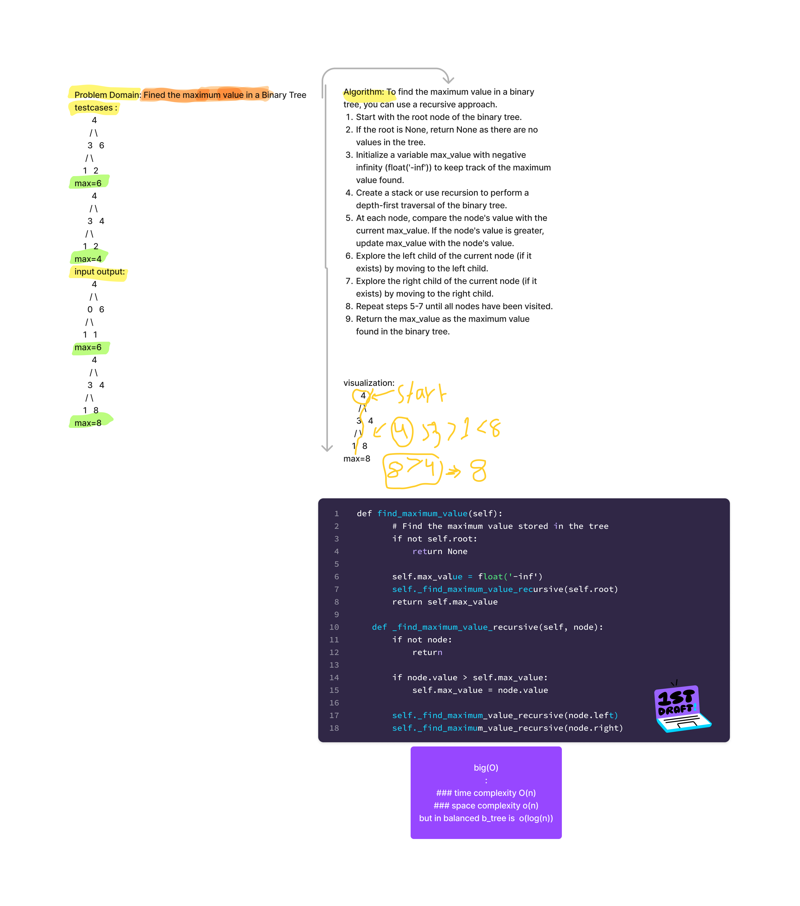

# CC16 Fined max value in tree DS 
## whiteboard

# summary and description :
The "Maximum Value in a Binary Tree" problem deals with finding the maximum value stored in a binary tree data structure. Given a binary tree as input, the task is to identify and return the largest value present in the tree.
Fined the maximum value in a Binary Tree
## approach and effecincy :
### time complexity  O(n)
### space complexity o(n) but in balanced b_tree is  o(log(n))
****
## [link to code](tree.py)