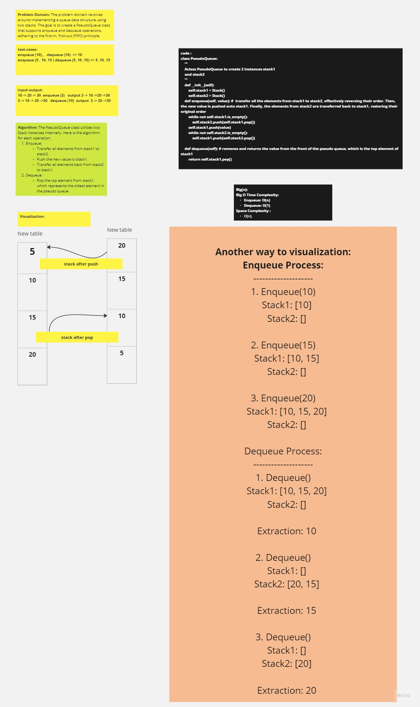

# Code Challenge: Class 11
## stack-queue-pseudo
***
## WhitwBoard:

****
## Summary -approach && effenciy:
### Summary:

The PseudoQueue class implements a queue using two stacks internally. It follows the first-in, first-out (FIFO) approach for enqueue and dequeue operations. The enqueue operation inserts a value into the pseudo queue, and the dequeue operation extracts a value from the pseudo queue.

### Approach:
The PseudoQueue class utilizes two instances of the Stack class to manage the queue. When enqueue is called, it transfers all elements from stack1 to stack2, then pushes the new value to stack1. After that, it transfers all elements back from stack2 to stack1, ensuring that the newly inserted value is at the bottom of stack1, maintaining the FIFO order.

For the dequeue operation, it simply pops the top element from stack1, which represents the oldest element in the pseudo queue, following the FIFO order.

### Efficiency:
The enqueue operation has a time complexity of O(n), where n is the number of elements in the pseudo queue. This is because it involves transferring all elements between the two stacks.

The dequeue operation has a time complexity of O(1), as it directly pops the top element from stack1.

Overall, the PseudoQueue class provides a way to implement a queue using two stacks while maintaining the FIFO behavior. However, the enqueue operation's time complexity could be a potential drawback when the pseudo queue contains a large number of elements.

***

## [Linke-to-my-solution](./stack_queue/stack.py)