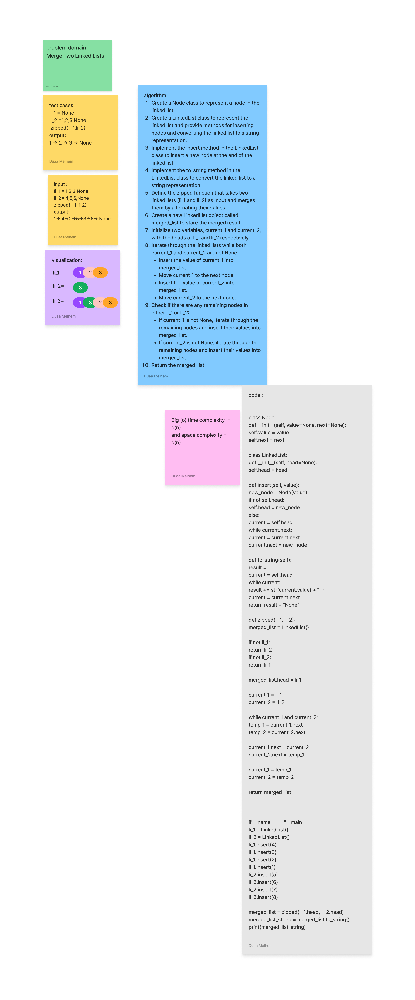

# Code Challenge -8 Zip_linkedlists
****
 
***
## WhiteBoard:

*****
# summary and description : 
is about merge betweene nodes of 2 linked-lists 
so that I used function which has 2 arguments (li1,li2)
and return one linked-list which called  zipped
-***
## Approach && Efficiency:
two linked lists (li_1 and li_2) simultaneously and merge them by alternating their values.
It uses a merged_list variable of type LinkedList to store the merged result.
Two variables, current_1 and current_2, are used to traverse the two linked lists.
The algorithm iterates through the linked lists, inserting the values into merged_list in an alternating fashion.
Finally, it checks if there are any remaining nodes in either li_1 or li_2 and inserts their values into merged_list.
The merged list is returned as the final result.
Efficiency:

The time complexity of the algorithm is O(n), where n is the total number of nodes in both linked lists.
This is because the algorithm needs to iterate through all the nodes in both linked lists to merge them.
The space complexity of the algorithm is O(1) since it doesn't require any additional space that grows with the input size.
The algorithm modifies the input linked lists in place and creates a new LinkedList object for the merged result, but it doesn't require extra space proportional to the input size.
Overall, the algorithm is efficient in terms of time and space complexity.

# solution
[link to my code ](./linked_zip/zipped_lists.py)

